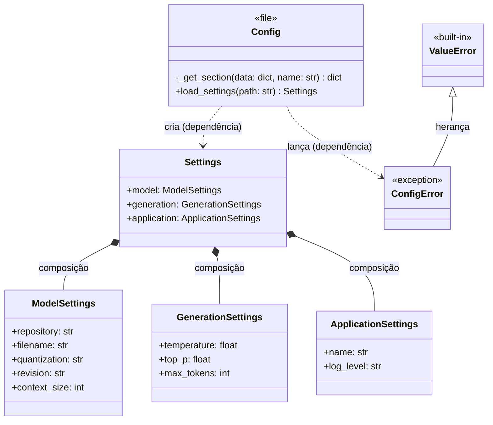

# English Conversation Coach

Projeto educacional para construir, passo a passo, um parceiro de conversação em inglês com [Qwen3-4B-GGUF](https://huggingface.co/Qwen/Qwen3-4B-GGUF), `llama-cpp-python` e Streamlit. A arquitetura separa interface, lógica da conversa, inferência e configuração para facilitar testes e evolução segundo princípios de MLOps/LLMOps.


## Índice

- [Executar localmente](#executar-localmente)
- [Estrutura do projeto](#estrutura-do-projeto)
- [Arquitetura e fluxo da conversa](#arquitetura-e-fluxo-da-conversa)
  - [Configuração](##Configuração (src/config.py))
- [Testes e estado atual](#testes-e-estado-atual)
- [Princípios de MLOps/LLMOps usados até aqui](#princípios-de-mlopsllmops-usados-até-aqui)

## Executar localmente

Requisito: Python 3.11, 3.12 ou 3.13. Na raiz do projeto:

```bash
python3 -m venv .venv
source .venv/bin/activate
python -m pip install -e ".[dev]"
```

```bash 
python -m streamlit run app.py
```

Abra `http://localhost:8501`. Se o arquivo GGUF ainda não estiver em `models/`, use o botão de download na barra lateral. O arquivo configurado tem aproximadamente 2,5 GB; a primeira carga e a geração local podem demorar conforme o computador.

Para conversar com o modelo diretamente pelo terminal, depois de baixar o GGUF:

```bash
python teste_manual.py
```

Para executar os testes, sem carregar o modelo real:

```bash
python -m pytest -v
```

Para executar apenas os testes de `model.py`:

```bash
python -m pytest tests/test_model.py -v
```

## Estrutura do projeto

```text
english-conversation-coach/
├── app.py                         Interface Streamlit
├── teste_manual.py                Para testes em gerais
├── config/settings.yaml           Parâmetros do modelo e da geração
├── prompts/system_prompt.txt      Instruções do agente
├── src/english_coach/
│   ├── chat.py                     Montagem da conversa e tratamento da resposta
│   ├── config.py                   Leitura e validação da configuração
│   ├── model.py                    Download, carga e inferência do GGUF
│   └── logging_config.py           Espaço reservado para observabilidade
├── tests/                          Testes automatizados por camada
├── models/                         Pesos locais, ignorados pelo Git
├── data/                           Dados futuros, ignorados pelo Git
├── pyproject.toml                  Metadados, dependências e configuração das ferramentas
└── README.md                       Uso e arquitetura
```

O `.env.example` mostra variáveis locais possíveis, mas o aplicativo ainda não lê um `.env`. Arquivos `.env` reais são ignorados pelo Git.

## Arquitetura e fluxo da conversa

```text
Navegador
   │
   ▼
app.py (Streamlit) ───────────► config.py ─────► config/settings.yaml
   │
   ▼
chat.py ───────────────────────► prompts/system_prompt.txt
   │
   ▼
model.py ──────────────────────► Qwen GGUF em models/
   │
   ▼
chat.py devolve o texto ──────► app.py exibe e guarda no histórico
```

O fluxo `app.py → chat.py → model.py → Qwen` já está implementado. Cada módulo tem uma responsabilidade:

- **Interface — [`app.py`](app.py):** configura e renderiza a página, mostra a configuração ativa, recebe mensagens e exibe o histórico. O Streamlit reexecuta o script a cada interação; `st.session_state` mantém o histórico e o modelo carregado durante a sessão. A entrada de chat só é habilitada quando o GGUF está disponível localmente.
- **Lógica da conversa — [`chat.py`](src/english_coach/chat.py):** lê o prompt de sistema, combina-o com o histórico e a nova mensagem, chama a inferência e remove eventuais tags `<think>` da resposta apresentada. Assim, a interface não precisa conhecer a API do `llama-cpp-python`.
- **Conexão com o LLM — [`model.py`](src/english_coach/model.py):** identifica o arquivo esperado, verifica se existe, baixa a revisão configurada do Hugging Face quando solicitado, carrega o GGUF com `Llama` e chama `create_chat_completion` com os parâmetros de geração. Erros de arquivo e inferência têm exceções próprias.
- **Configuração — [`config.py`](src/english_coach/config.py) e [`settings.yaml`](config/settings.yaml):** o YAML define `model`, `generation` e `application`. O módulo Python converte esses valores em dataclasses imutáveis e valida os limites antes da inferência. A revisão do modelo, o nome do arquivo e a quantização ficam explícitos para reprodução.
- **Prompt — [`system_prompt.txt`](prompts/system_prompt.txt):** define o comportamento do parceiro de inglês separadamente da interface e da biblioteca de inferência. Isso facilita revisar e comparar versões das instruções.
- **Observabilidade — [`logging_config.py`](src/english_coach/logging_config.py):** ainda é um placeholder. O plano é registrar erros e tempos de carga/geração em `logs/`, sem salvar o conteúdo das conversas por padrão, pois ele pode conter dados pessoais.

O modelo configurado hoje é `Qwen/Qwen3-4B-GGUF`, arquivo `Qwen3-4B-Q4_K_M.gguf`, quantização `Q4_K_M`. Os pesos ficam em `models/` e não entram no Git. `data/`, `logs/` e `artifacts/` ficam reservados para dados, observabilidade e avaliações futuras.

## Diagrama de Classes

### Configuração

**Módulo:** config.py\
**Classes:** Settings, ApplicationSettings, GeneretionSettings e ModelSettings.\
**Funções:** load_settings()\
**Funções internas:** _get_section()





## Testes e estado atual

Os testes em `tests/` seguem as responsabilidades do projeto:

| Arquivo | O que verifica |
| --- | --- |
| `test_app.py` | Inicialização da interface, entrada e histórico |
| `test_chat.py` | Montagem das mensagens e tratamento da resposta |
| `test_config.py` | Leitura do YAML e rejeição de parâmetros inválidos |
| `test_model.py` | Download e inferência com dependências simuladas |
| `test_package.py` | Importação e versão do pacote |

A suíte cotidiana não precisa carregar o GGUF. Para verificar a inferência de verdade, use `teste_manual.py`; um teste de integração automatizado com o modelo real ainda é uma evolução futura.

| Componente | Estado |
| --- | --- |
| Interface, histórico e conversa com Qwen no Streamlit | Implementados |
| Configuração tipada e validada | Implementada |
| Prompt separado e conectado à conversa | Implementado |
| Download, carga e inferência do GGUF | Implementados |
| Testes automatizados sem modelo real | Implementados |
| Logs, métricas e avaliações pedagógicas | Planejados |

## Princípios de MLOps/LLMOps usados até aqui

- **Separação de responsabilidades:** interface, regras da conversa, configuração e inferência podem evoluir independentemente.
- **Reprodutibilidade:** dependências declaradas, revisão do modelo e parâmetros de geração explícitos.
- **Artefatos fora do Git:** pesos, dados e logs não são versionados com o código.
- **Testes rápidos:** simulações verificam comportamento sem baixar ou carregar um modelo de vários gigabytes.
- **Prompt separado:** regras pedagógicas podem ser alteradas e avaliadas sem mudar a camada de inferência.

Próximos passos: implementar logs de erros e tempos; criar avaliações para qualidade da correção, brevidade e continuidade da conversa.
